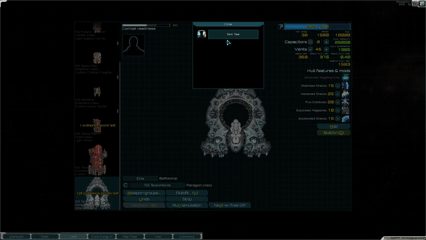
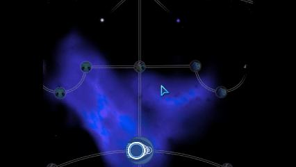
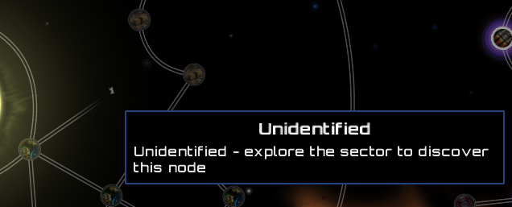
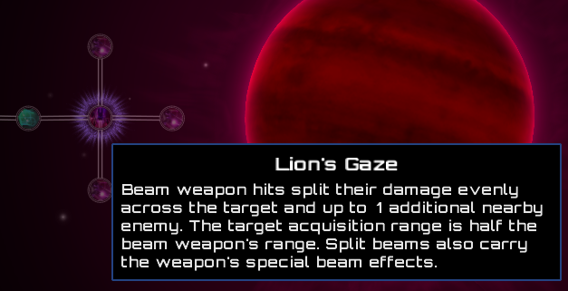
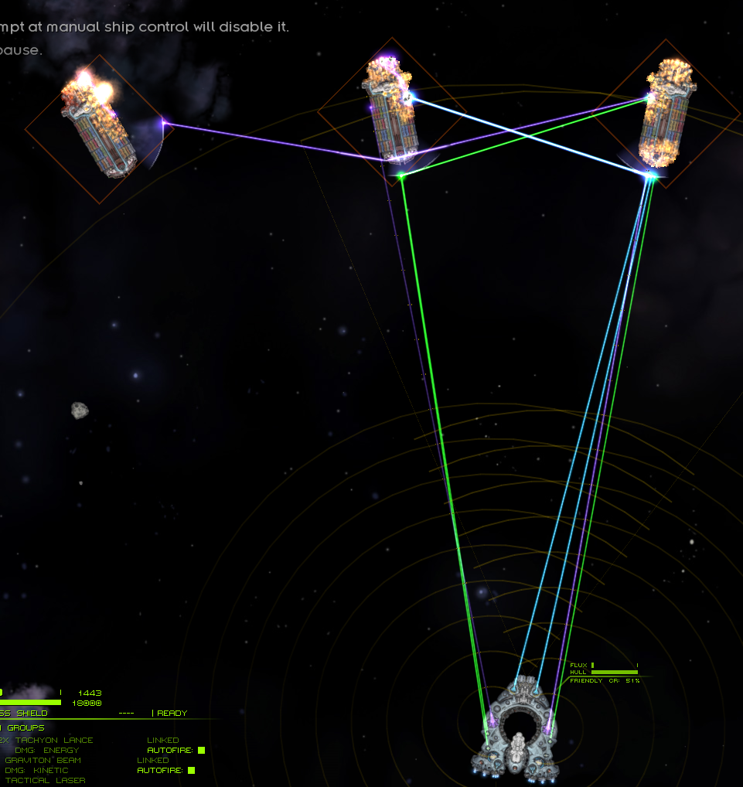
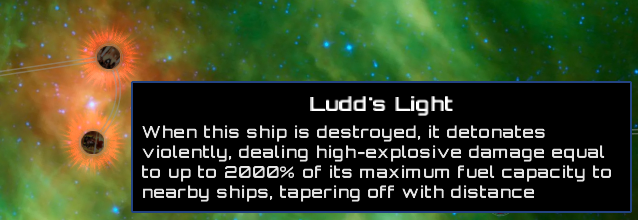
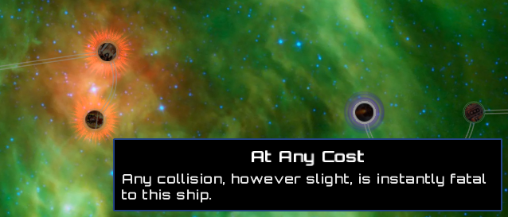

# Exiled Sector

Because your Hound deserves a character arc.

Designed to be an overhaul of the simple hullmod system based on the infamous Path of Exile skill tree, ExiledSector is a [Starsector](https://fractalsoftworks.com/) mod that gives every ship in your fleet its own skill tree. Still sane exile?

[](https://trilink.wispborne.com/open.html?mod=%7B%22url%22%3A%22https%3A%2F%2Fraw.githubusercontent.com%2FExiledPortals%2FExiledSector%2Fmain%2FExiledSector.version%22%2C%22id%22%3A%22exiledSector%22%2C%22version%22%3A%220.1.0%22%7D&dep=%7B%22url%22%3A%22https%3A%2F%2Fraw.githubusercontent.com%2FLazyWizard%2Flazylib%2Fmaster%2Fmod%2Flazylib.version%22%2C%22id%22%3A%22lw_lazylib%22%2C%22version%22%3A%223.0.0%22%7D&dep=%7B%22url%22%3A%22https%3A%2F%2Fraw.githubusercontent.com%2FMagicLibStarsector%2FMagicLib%2Fmaster%2Fmagiclib.version%22%2C%22id%22%3A%22MagicLib%22%2C%22version%22%3A%221.5.6%22%7D&dep=%7B%22url%22%3A%22https%3A%2F%2Fraw.githubusercontent.com%2FLukas22041%2FLunaLib%2Fmain%2FLunaLib.version%22%2C%22id%22%3A%22lunalib%22%2C%22version%22%3A%222.0.5%22%7D) 

[Manual download](https://github.com/ExiledPortals/ExiledSector/releases/latest/download/ExiledSector.zip)

## Features

- Navigate to the outfit screen and click the skill tree button on any of your ships to explore an entirely new sector:

- A 400+ node tree per ship.
- Multi-choice travel nodes.

- **Synergistic allocation** 
  - Every allocated node initially costs OP: 1 for frigates, 2 for destroyers, 3 for cruisers and 4 for capitals.
  - Ships also earn XP in combat, and can level up. 
  - Each level allows you to allocate one node on the tree for free, so veteran ships get their ordnance points back. The crew gets nothing, as is tradition.
- Hidden, unlockable nodes.

  
- Unique passive effects
- **Beam splitting** 
  - Your Tachyon Lance can now disappoint multiple enemies at once.
  

- **Faction themed**
  - Your ship's main goal can be to blow up, and act like it don't know nobody

## Requirements

- Starsector 0.98a-RC8
- [LazyLib](https://fractalsoftworks.com/forum/index.php?topic=5444.225)
- [MagicLib](https://fractalsoftworks.com/forum/index.php?topic=25868.0)
- [LunaLib](https://fractalsoftworks.com/forum/index.php?topic=25658.0)

Optional:

- Console Commands adds `ExiledSectorGrantFleetXp [amount]`.
- a healthy disregard for vanilla balance.

## Configuration

Play your own way – all settings are in the LunaLib mod settings menu:

- OP cost per node, by hull size
- Leveling curve: max level, XP per level, XP growth, and XP gained from a lost battle
- Maximum number of allocated nodes per ship
- Whether hidden nodes are revealed, and which unlock conditions are enforced

## Disclaimer

This mod is in (very) early development. 

It is my first mod, and first foray into OpenGL/game development, and is by no means feature complete or bug free.

I have used starsector-core graphics and royalty-free art assets for all art in the mod. I have not and will not use LLM-generated art.

I am seeking any feedback, bug reports, node suggestions, or faction designs. 

You can find me on the [Unofficial Starsector Discord](https://fractalsoftworks.com/forum/index.php?topic=11488.0) or by direct message: @portals_ 

### Compatibility

> [!WARNING]
> Exiled Sector adds permanent hull mods to the ships in your fleet. Don't remove it from a save that has used it.

I have done what I can for some mods, but there is a long way to go for complete mod compatibility.

**[Second-in-Command](https://fractalsoftworks.com/forum/index.php?topic=30407.0)** is (theoretically) supported.

Some weapons from other mods misbehave (sometimes hilariously) when their beams are split or their shots are chained. These are listed in:

- `data/config/exiledSector/split_beam_effect_blocklist.csv`
- `data/config/exiledSector/energy_chain_blocklist.csv`

Both files are merged across mods, so other mods can opt their own weapons out.